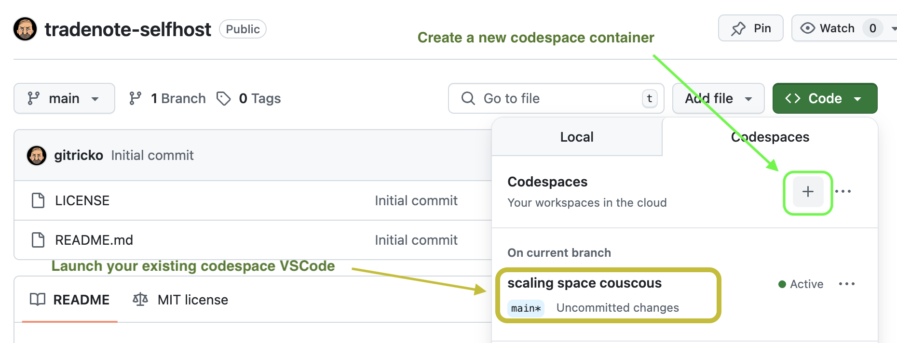
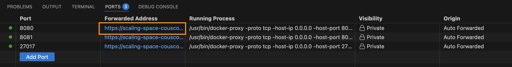
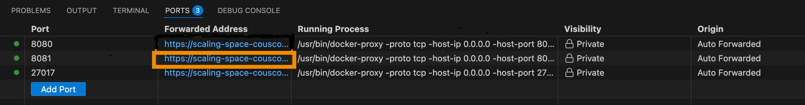

[](https://github.com/gitricko/tradenote-selfhost/actions/workflows/test.yml)
[](https://github.com/gitricko/tradenote-selfhost/actions/workflows/codacy.yml)


# TradeNote-SelfHost
**TradeNote-SelfHost** is a user-friendly CLI tool that enables traders to host and use [TradeNote](https://github.com/Eleven-Trading/TradeNote), an open-source trading journal, without dedicated hardware by running it in GitHub Codespaces. The CLI simplifies data backup and restoration, and the `make` commands work on any Linux or macOS system with the required dependencies (e.g., Docker).

## What's New

- Documentation and code to support hosting on MacOS or any linux machine

## Getting Started

### Prerequisites
To run TradeNote-SelfHost, ensure you have:
- a GitHub account to use Codespaces (No additional software requirements)
- Linux/macOS:
  - Docker installed with `docker compose` plugin. Use [brew-install-docker-compose](https://formulae.brew.sh/formula/docker-compose)
  - GIT cli is installed with `git-lfs` plugin installed. Use [brew-install-git-lfs](https://formulae.brew.sh/formula/git-lfs)

### Running TradeNote in GitHub Codespaces (Recommended)

1. **Fork the Repository**:
   - Fork or copy all files from this repository to your GitHub account.
   - Open the repository in GitHub, click the green **Code** button, and select **Create Codespace** to launch a Codespace instance.
   - 

2. **Start TradeNote**:
   - In the Codespace terminal, run:
     ```bash
     make start
     ```
   - Once the service starts, find the URI in the **Ports** tab of Codespace. Click the forwarded address for port `8080` to access TradeNote.
   - 

3. **Log In**:
   - Use the default credentials defined in the `Makefile` variable `TN_USER` (username and password are the same).
     - Default is: `tn@tn`
   - Alternatively, create a new user via the TradeNote interface.

### Useful Commands

Here are the primary `make` commands you need:

- **`make start`**:
  - Starts the TradeNote service.
- **`make backup`**:
  - Creates a backup of your data as a `.tar.gz` file, stored in `./backup/tradenote_db_backup.tar.gz`.
  - **Tip**: Commit this file to your GitHub repository periodically to secure your backup.
- **`make restore`**:
  - Restores your data from the backup file in a new Codespace instance (e.g., after GitHub deletes an inactive Codespace after 30 days).

### Restoring Data
If you need to start a new Codespace instance:
1. Fork the repository and launch a new Codespace (as described above).
2. Copy your backup file (`tradenote_db_backup.tar.gz`) to the `./backup` directory or pull from your git repository.
3. Run:
   ```bash
   make restore
   ```
   
### Accessing Mongo Express
TradeNote-SelfHost includes [Mongo Express](https://github.com/mongo-express/mongo-express), a web-based interface for viewing and managing your TradeNote database (if needed)

1. **Start the Service**:
   - Run `make start` to launch both TradeNote and Mongo Express as describe above.
   - Once the services start, locate the Mongo Express URI in the **Ports** tab of Codespace. Click the forwarded address for port `8081` to access Mongo Express.
   - 

2. **Log In**:
   - Use the default credentials defined in the `docker-compose.yml` file:
     - **Username**: `tn`
     - **Password**: `tn`

3. **Usage**:
   - Mongo Express allows you to browse, edit, or query your TradeNote database directly from the web interface.
   - **Note**: Be cautious when modifying data, as changes are applied directly to the database.

## Security Considerations for Running TradeNote in Codespaces

Running TradeNote in GitHub Codespaces is secure, as access to the Codespace URI is restricted to the GitHub user who owns the repository. This inherently protects the default credentials for TradeNote and Mongo Express (defined in `docker-compose.yml`). However, to ensure your data remains secure, follow these best practices:

- **Keep Your Repository Private**: Ensure your GitHub repository is set to private to prevent unauthorized access to your backup file (`./backup/tradenote_db_backup.tar.gz`) if you commit it to the repository.
- **Limit Codespace Access**: Only share Codespace access with trusted collaborators via GitHub repository permissions.
- **Secure Backup Storage**: If committing backups to GitHub, consider encrypting the backup file (`tradenote_db_backup.tar.gz`) before committing to add an extra layer of security.
- **Monitor Codespace Usage**: Regularly check your GitHub Codespaces for active instances, as inactive instances are deleted after 30 days, potentially requiring data restoration.

By following these steps, you can minimize security risks and safely use TradeNote in Codespaces.

## 🕊️ [In Memory of Paul Goh](https://gofund.me/6789235f)

This project is dedicated to the memory of [@paulgoh](https://github.com/paulgoh), my collegue, my friend and my brother who was meant to be the first user of TradeNote-SelfHost. RIP 💙
